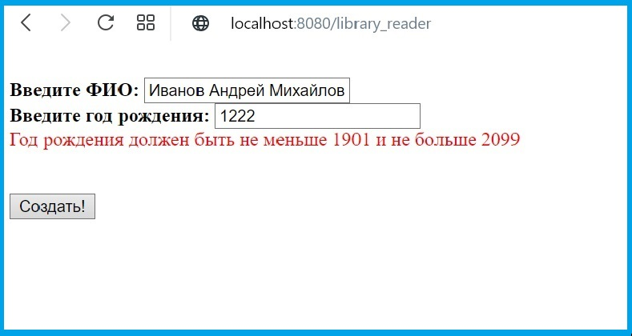
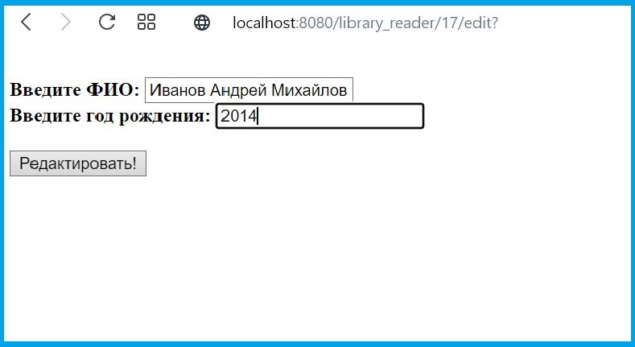
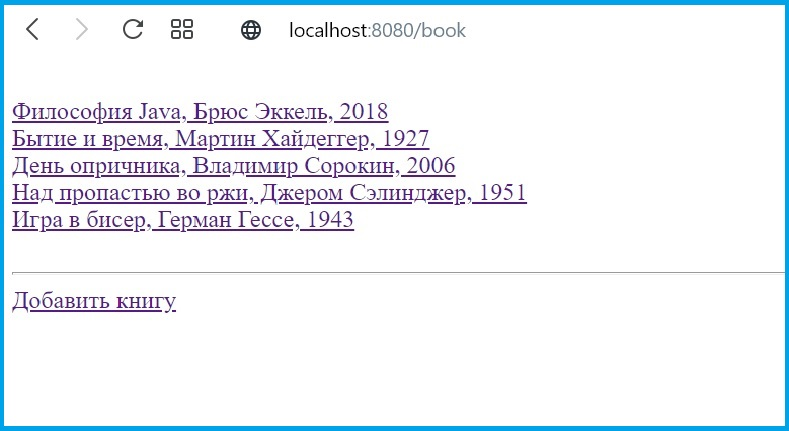
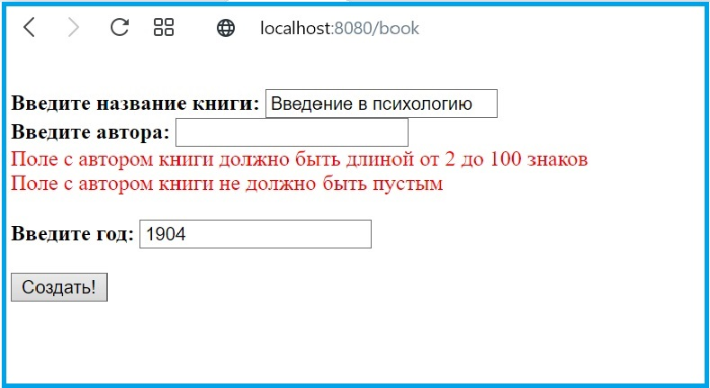
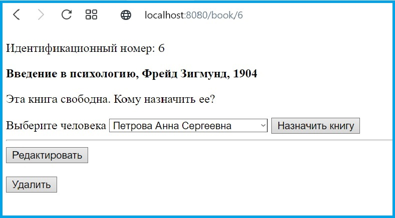
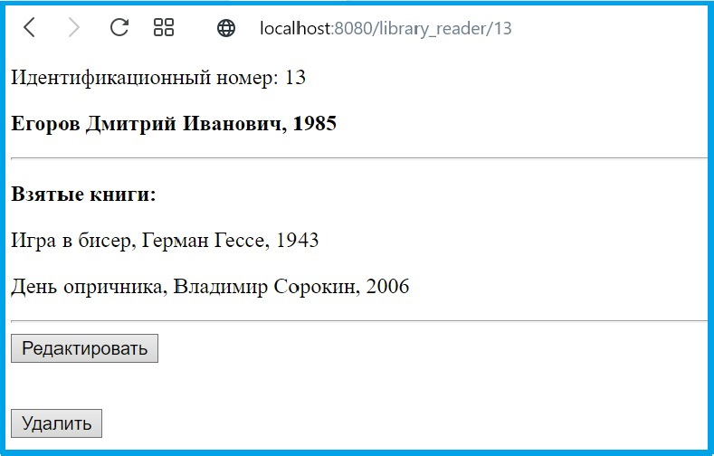

# Учебный проект "Цифровой учет книг в библиотеке"
(стек применяемых технологий: *Spring, PostgreSQL, Thymeleaf*)

**Задача:**

В местной библиотеке решили перейти на цифровой учет книг. Библиотекари имеют возможность регистрировать читателей, выдавать им книги и освобождать книги (после того, как читатель возвращает книгу обратно в библиотеку).

Функционал:
1) Страницы добавления, изменения и удаления читателей.
2) Страницы добавления, изменения и удаления книги.
3) Страница со списком всех людей (люди кликабельные - при клике осуществляется переход на страницу читателя).
4) Страница со списком всех книг (книги кликабельные - при клике осуществляется переход на страницу книги).
5) Страница читателя, на которой показаны значения его полей и список книг, которые он взял. Если человек не взял ни одной книги, вместо списка должен быть текст "Читатель пока не взял ни одной книги".
6) Страница книги, на которой показаны значения полей этой книги и имя человека, который взял эту книгу. Если эта книга не была никем взята, должен быть текст "Эта книга свободна".
7) На странице книги, если книга взята читателем, рядом с его именем должна быть кнопка "Освободить книгу". Эта кнопка нажимается библиотекарем тогда, когда читатель возвращает эту книгу обратно в библиотеку. После нажатия на эту кнопку книга снова становится свободна и пропадает из списка книг человека.
8) На странице книги, если книга свободна, должен быть выпадающий список со всеми людьми и кнопка "Назначить книгу". Эта кнопка нажимается библиотекарем тогда, когда читатель хочет забрать эту книгу домой. После нажатия на эту кнопку, книга должна начать принадлежать выбранному человеку и должна появится в его списке книг.
9) Все поля должны валидироваться.

## Изображения работы программы:
**1. Страница со списком всех читателей**

**2. Создание нового читателя (применяется валидация полей)**

**3. Страница читателя (у читателя не взята ни одна книга)**

**4. Страница редактирования читателя**

**5. Страница со списком всех книг**

**6. Страница редактирования книги (применяется валидация полей)**

**7. Страница книги (есть возможность назначить книгу читателю из выпадающего списка)**

**8. Страница редактирования книги**

**9. Страница книги (есть возможность высвободить книгу)**

**10. Страница читателя (присутствуют взятые книги)**

